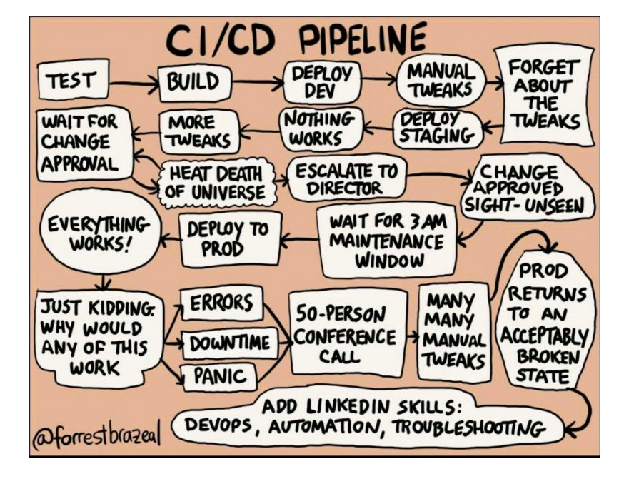
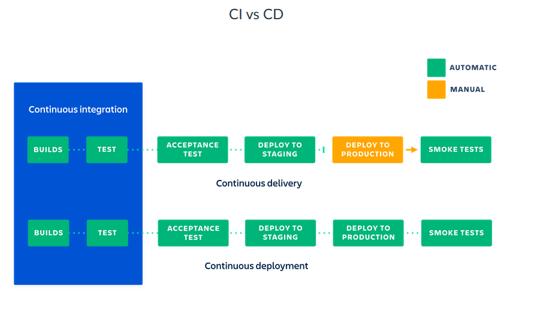
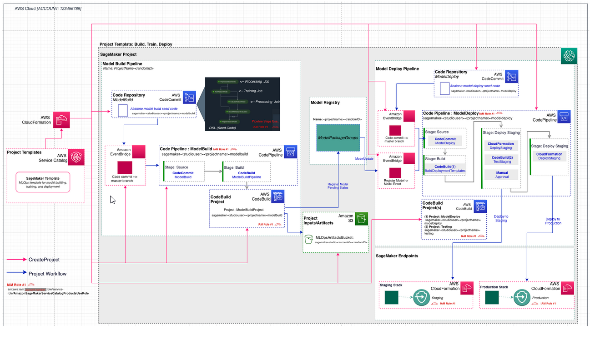
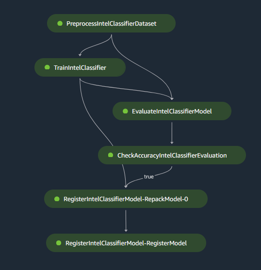
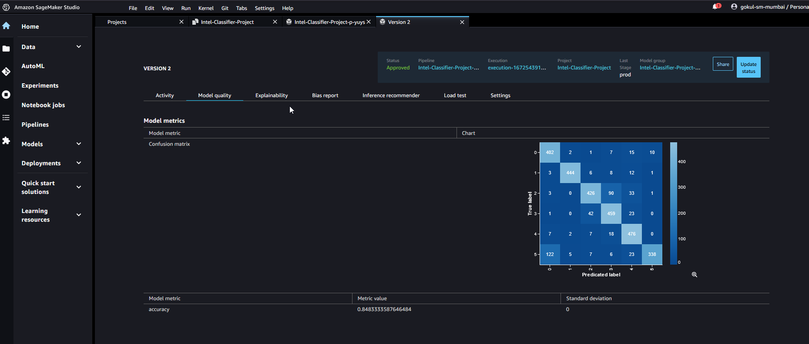

## AWS-CICD-Pipelines

Continuous integration and continuous deployment (CI/CD) is a software development practice where code changes are automatically built, tested, and deployed to production. This allows teams to quickly and reliably release new features and updates to their applications.

In a CI/CD workflow, developers will commit their code changes to a shared repository, such as a Git repository. This triggers an automated process that will build the code, run any tests, and package the code into a deployable form. If the build and tests pass, the code is automatically deployed to production. This allows teams to quickly and reliably release new features and updates to their users.

Overall, CI/CD helps teams to deliver high-quality software faster and more reliably by automating the build, test, and deployment process.

### CI/CD using Sagemaker

Here, I try to set up end to end MLOps pipeline using Amazon Sagemaker. The overall architecture for the pipeline is shown below

There are two CodeCommit repositories
* ModelBuild: This contains code for creating and running the SageMaker pipeline, and then conditionally registering the model. [link](https://github.com/gokul-pv/sagemaker-intel-project-modelbuild)
* ModelDeploy: This contains code for deploying the model to a staging endpoint, and once approved the same thing is then deployed to a production endpoint. [link](https://github.com/gokul-pv/sagemaker-intel-project-modeldeploy)

Every time there is commit in the ModelBuild repo, Code Pipeline is triggered by the Event bridge. This Code Pipeline will take the ModelBuild repo and build the Sagemaker pipeline shown below using Code Build

Once the Code build is completed, the artifacts are stored in S3 and trained model is registered in the model registry if accurarcy is greater than 60%. The test accuracy and confusion matrix are logged and based on these matrices we can either approve or reject the model. This is a manual step.

Every time the model is approved or there is a commit in the ModelDeploy, another Code Pipeline is triggered by the Event Bridge. This Pipeline will build two cloud formation templates using CodeBuild - one for staging environment and one for production environment. Once the staging environment is set up by cloud formation, another code build will test the staging environment. If the tests are passed, we have to manually approve, which will deploy the exact same staging environment to production.

Check out this [notebook](./notebooks/05-test-staging.ipynb) where I have tested the staging and production end pints with some test images.

